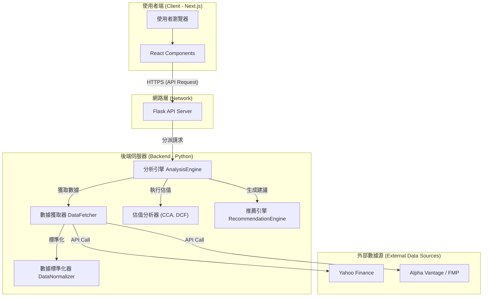

<div align="center">
  
  <h1 align="center">CapitalCore</h1>
  <p align="center">
    一個專業級的投資銀行分析平台，整合多種權威估值模型，為您提供精準的股票分析與智能投資建議。
  </p>

  <!-- Badges -->
  <p align="center">
    
    
    
    
    
  </p>
</div>

---

**CapitalCore** 旨在將複雜且耗時的金融分析流程自動化、透明化。透過最先進的技術棧與嚴謹的金融模型，本平台讓專業投資者、分析師及金融愛好者，都能快速獲取深度、可靠的個股分析報告，從而做出更明智的投資決策。

## 🌟 核心功能

- **📈 多模型估值引擎**: 
  - **相對估值法 (CCA)**: 比較同業公司的估值倍數 (P/E, EV/EBITDA)。
  - **現金流折現法 (DCF)**: 預測未來現金流並折現，評估公司內在價值。
  - **交易比率法 (PTA)**: 分析可比公司的併購交易，評估含控制權溢價的價值。
  - **資產基礎法**: 評估公司的淨資產價值，提供價值底線參考。

- **🤖 智慧推薦系統**:
  - **五級投資建議**: 強烈買入、買入、持有、賣出、強烈賣出。
  - **綜合評分卡**: 基於數十個因子，產出 0-100 分的綜合評分。
  - **透明化決策**: 詳細列出買入理由與潛在風險，並解釋各項權重。

- **📊 數據儀表板**:
  - **互動式圖表**: 視覺化呈現估值比較與歷史數據。
  - **數據透明度**: 提供原始 API 數據查看與一鍵複製功能，方便使用者自行驗證。
  - **專業級介面**: 採用現代化、資訊密集的設計，符合專業金融人員使用習慣。

- **🔌 多數據源整合**:
  - **智慧切換**: 自動整合 Yahoo Finance, Alpha Vantage, FMP 等多個數據源。
  - **數據標準化**: 內建強大的數據標準化引擎，確保跨來源數據的一致性與準確性。

## 🛠️ 技術棧 (Technology Stack)

| 層級 | 技術 | 用途與說明 |
| :--- | :--- | :--- |
| **前端 (Frontend)** | **Next.js 14** | 基於 React 的主流框架，提供伺服器端渲染(SSR)與優異的開發體驗。 |
| | **React 18** | 用於建構使用者介面的核心函式庫，採用元件化開發模式。 |
| | **TypeScript** | 為 JavaScript 提供靜態類型檢查，提升程式碼的健壯性與可維護性。 |
| | **TailwindCSS** | 一個功能優先的 CSS 框架，用於快速建構現代化的自訂設計。 |
| | **Framer Motion** | 提供流暢豐富的動畫效果，提升使用者互動體驗。 |
| **後端 (Backend)** | **Python 3.10+** | 主要開發語言，擁有豐富的數據科學與金融分析生態系。 |
| | **Flask** | 一個輕量級的 WSGI Web 應用框架，用於建構高效能的 RESTful API。 |
| | **yfinance** | 用於從 Yahoo Finance 獲取免費、即時的全球股票數據。 |
| **環境與工具** | **uv** | 一個極速的 Python 套件安裝與管理工具，取代傳統的 pip 與 venv。 |
| | **Node.js** | 前端開發與建置的執行環境。 |
| | **Git & GitHub** | 版本控制與程式碼託管。 |

## 🏗️ 系統架構

本系統採用經典的**前後端分離 (Client-Server) 架構**，透過 RESTful API 進行通訊，確保了高度的靈活性與可擴展性。



## 🚀 快速開始 (Getting Started)

請確保您的開發環境已安裝 [Python 3.10+](https://www.python.org/)、[Node.js 18+](https://nodejs.org/) 以及 [uv](https://github.com/astral-sh/uv)。

### 1. 取得專案

```bash
git clone https://github.com/atomjay/investment_analysis.git
cd investment_analysis
```

### 2. 環境設定

複製範例環境變數檔，並填入您的 API 金鑰。Alpha Vantage 和 FMP 是選擇性的，但建議至少填寫一組以獲得最完整的數據。

```bash
cp .env.example .env
```

`.env` 檔案內容:
```
# 建議至少提供一組，以獲得最完整的數據體驗
ALPHA_VANTAGE_API_KEY="YOUR_ALPHA_VANTAGE_KEY"
FMP_API_KEY="YOUR_FMP_KEY"
```

### 3. 安裝依賴

本專案使用 `uv` 管理後端 Python 環境，`npm` 管理前端 Node.js 環境。

```bash
# 安裝後端依賴 (在專案根目錄)
uv sync

# 安裝前端依賴
cd src/frontend
npm install
cd ../..
```

### 4. 啟動系統

您需要開啟兩個終端機視窗，分別啟動後端與前端服務。

**終端機 1: 啟動後端 API 伺服器**
```bash
# 從專案根目錄執行
uv run python src/run_backend.py
```
> ✅ 後端服務將運行於 `http://localhost:8000`。

**終端機 2: 啟動前端開發伺服器**
```bash
# 從專案根目錄執行
cd src/frontend
npm run dev
```
> ✅ 前端應用程式將運行於 `http://localhost:3000`。

現在，您可以開啟瀏覽器並訪問 `http://localhost:3000` 來開始使用 CapitalCore。

## 🧪 測試 (Testing)

我們重視程式碼的品質，專案內建了完整的測試指令。

```bash
# 運行後端單元測試
uv run python -m pytest tests/

# 運行前端單元測試
cd src/frontend
npm test

# 執行前端 TypeScript 類型檢查
cd src/frontend
npm run type-check
```

## 🤝 貢獻指南 (Contributing)

我們非常歡迎社群的貢獻！如果您希望參與開發，請遵循以下步驟：

1.  **Fork** 此專案。
2.  建立您的功能分支 (`git checkout -b feature/AmazingFeature`)。
3.  提交您的變更 (`git commit -m 'Add some AmazingFeature'`)。
4.  將您的分支推送到遠端 (`git push origin feature/AmazingFeature`)。
5.  開啟一個 **Pull Request**。

請確保您的程式碼遵循專案內的開發規範，並附上相關的測試。

## 📄 授權條款 (License)

本專案採用 **MIT License** 授權。詳情請見 `LICENSE` 檔案。

---

<div align="center">
  <p>Made with ❤️ by the Community</p>
</div>
