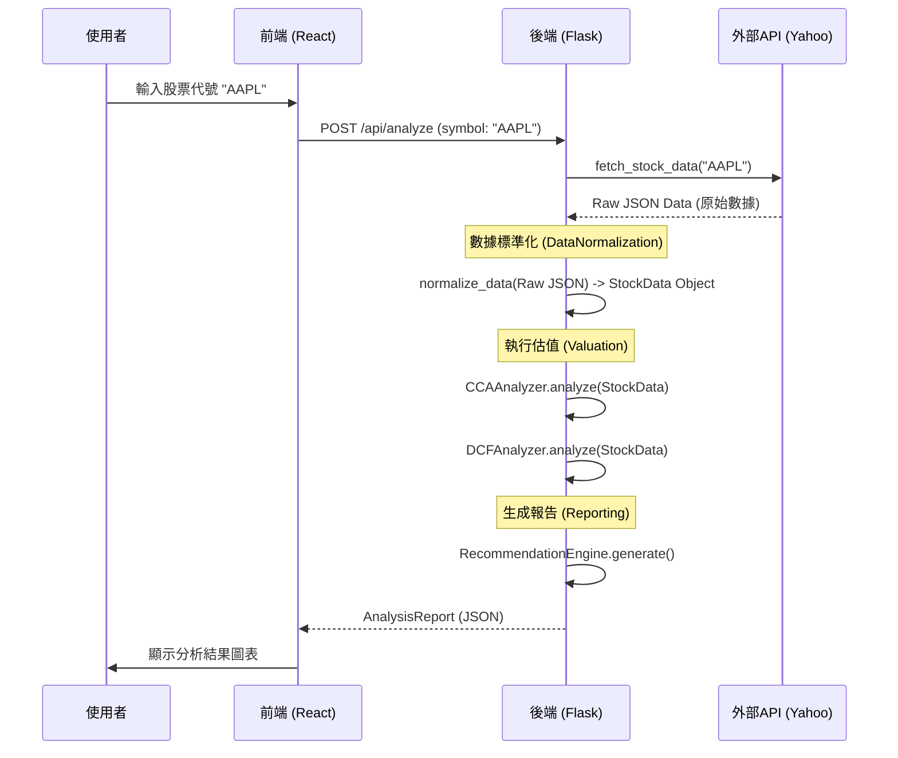

# CapitalCore 系統分析報告

> **文件版本**: 1.0  
> **報告日期**: 2025-06-29  
> **分析師**: Gemini  
> **專案名稱**: CapitalCore

---

## 1. 系統總覽 (System Overview)

CapitalCore 是一個專業級的投資銀行分析平台，旨在為使用者提供對上市公司的深度財務分析與估值。系統整合了多種業界標準的估值模型，透過自動化的數據獲取、標準化處理和複雜計算，最終產出包含明確投資建議、目標價格和風險評估的綜合分析報告。

其核心價值在於將複雜、耗時的金融分析流程自動化、透明化，並以現代化的使用者介面呈現，讓專業投資者與分析師能快速獲取決策依據。

**主要功能模組:**
- **多數據源整合**: 智慧切換 Yahoo Finance, Alpha Vantage, FMP 等數據源。
- **數據標準化引擎**: 確保跨來源數據的一致性與可比性。
- **多模型估值引擎**: 實現四種核心估值方法 (CCA, DCF, PTA, Asset-Based)。
- **智慧推薦系統**: 根據綜合評分產出五級投資建議 (強烈買入至強烈賣出)。
- **現代化Web前端**: 使用 Next.js 和 TypeScript 打造的互動式分析介面。
- **RESTful API 服務**: 以 Flask 框架提供穩定、高效的後端運算支援。

---

## 2. 技術棧 (Technology Stack)

CapitalCore 採用了現代化的前後端分離技術棧，確保了系統的效能、可維護性與擴展性。

| 層級 | 技術 | 用途與說明 |
| :--- | :--- | :--- |
| **前端 (Frontend)** | **Next.js 14** | 基於 React 的主流框架，提供伺服器端渲染(SSR)與靜態網站生成(SSG)能力。 |
| | **React 18** | 用於建構使用者介面的核心函式庫，採用元件化開發模式。 |
| | **TypeScript** | 為 JavaScript 提供靜態類型檢查，提升程式碼的健壯性與可維護性。 |
| | **TailwindCSS** | 一個功能優先的 CSS 框架，用於快速建構現代化的自訂設計。 |
| | **Framer Motion** | 提供豐富的動畫效果，提升使用者互動體驗。 |
| | **TanStack Query** | (隱含使用) 管理伺服器狀態、快取、同步與更新數據。 |
| **後端 (Backend)** | **Python 3.10+** | 主要開發語言，擁有豐富的數據科學與金融分析生態系。 |
| | **Flask** | 一個輕量級的 WSGI Web 應用框架，用於建構 RESTful API。 |
| | **yfinance** | 用於從 Yahoo Finance 獲取免費股票數據的函式庫。 |
| **環境與工具** | **uv** | 一個極速的 Python 套件安裝與管理工具，取代傳統的 pip 與 venv。 |
| | **Node.js** | 前端開發與建置的執行環境。 |
| | **Git & GitHub** | 版本控制與程式碼託管。 |

---

## 3. 系統架構 (System Architecture)

本系統採用經典的**前後端分離 (Client-Server) 架構**，透過 RESTful API 進行通訊。

```mermaid
graph TD
    subgraph "使用者端 (Client)"
        A[使用者瀏覽器] --> B{Next.js / React};
    end

    subgraph "網路層 (Network)"
        B -- "HTTPS (API Request)" --> C[Flask API Server];
    end

    subgraph "後端伺服器 (Backend Server)"
        C -- "分派請求" --> D[分析引擎 AnalysisEngine];
        D -- "獲取數據" --> E[數據獲取器 DataFetcher];
        E -- "標準化" --> F[數據標準化器 DataNormalizer];
        D -- "執行估值" --> G[估值分析器 (CCA, DCF)];
        D -- "生成建議" --> H[推薦引擎 RecommendationEngine];
    end

    subgraph "外部數據源 (External Data Sources)"
        E -- "API Call" --> I[Yahoo Finance];
        E -- "API Call" --> J[Alpha Vantage / FMP];
    end

    %% Styling
    style A fill:#f9f,stroke:#333,stroke-width:2px
    style B fill:#9cf,stroke:#333,stroke-width:2px
    style C fill:#f96,stroke:#333,stroke-width:2px
    style D fill:#6c6,stroke:#333,stroke-width:2px
```

**架構優點:**
- **關注點分離 (Separation of Concerns)**: 前後端職責清晰，可獨立開發、測試與部署。
- **技術選型靈活**: 前後端可選用最適合其場景的技術棧。
- **可擴展性**: 後端可作為無狀態服務進行水平擴展，前端可透過 CDN 進行全球分發。
- **多客戶端支援**: 未來可輕易擴展支援行動 App 或其他客戶端，共用同一套後端 API。

---

## 4. 後端分析 (Backend Analysis)

後端是 CapitalCore 的運算核心，負責所有數據處理、複雜計算與商業邏輯。

### 4.1. 核心流程

1.  **啟動服務**: 透過 `src/run_backend.py` 啟動 Flask 應用 (`src/frontend/web_app.py`)。
2.  **API 路由**: `web_app.py` 定義了所有 API 端點，如 `/api/analyze`。當請求進入時，它會實例化 `AnalysisEngine`。
3.  **分析協調**: `AnalysisEngine` (`src/backend/analysis_engine.py`) 是核心協調器。其 `analyze_stock` 方法會依序執行以下步驟：
    a. **數據獲取**: 呼叫 `YahooFinanceDataFetcher` (`src/backend/data/yahoo_finance_fetcher.py`) 從外部 API 抓取數據。
    b. **數據標準化**: 獲取到的原始數據會被傳遞給 `DataNormalizer` (`src/backend/data/data_normalizer.py`) 進行清洗和格式統一。
    c. **估值分析**: `AnalysisEngine` 呼叫 `CCAAnalyzer` 和 `DCFAnalyzer` 等估值模組，傳入標準化後的 `StockData` 物件。
    d. **建議生成**: `RecommendationEngine` 根據多個估值模型的結果，結合預設規則，產生最終的投資建議。
4.  **回應產出**: `AnalysisEngine` 將所有結果組裝成 `AnalysisReport` 物件，並由 API 路由序列化為 JSON 格式返回給前端。

### 4.2. 重要模組與函式

| 模組/檔案 | 重要函式/類別 | 職責說明 |
| :--- | :--- | :--- |
| `analysis_engine.py` | `AnalysisEngine` | **核心協調器**。管理整個分析流程，從數據獲取到報告生成。 |
| | `analyze_stock()` | 執行完整的股票分析，整合所有估值與推薦邏輯。 |
| | `_perform_valuation_analysis()` | 依序執行多種估值方法 (CCA, DCF, PTA 等)。 |
| | `_calculate_wacc()` | **關鍵財務計算**。使用資本資產定價模型(CAPM)和公司實際資本結構計算加權平均資本成本(WACC)，是DCF估值的核心輸入。 |
| `yahoo_finance_fetcher.py` | `YahooFinanceDataFetcher` | **數據來源介面**。封裝了 `yfinance` 函式庫，負責從 Yahoo Finance 獲取原始股票數據。 |
| | `fetch_stock_data()` | 獲取特定股票的詳細財務數據、價格、公司資訊等。 |
| `data_normalizer.py` | `DataNormalizer` | **數據清洗與統一**。將來自不同 API 的異構數據 (如 `marketCap`, `MarketCapitalization`) 標準化為統一的內部格式 (`market_cap`)，並處理單位轉換 (如 `B`, `M` 到實際數值)。 |
| | `normalize_data()` | 根據預定義的映射規則，對原始數據字典進行標準化。 |
| `cca_analyzer.py` | `CCAAnalyzer` | **相對估值法 (CCA) 引擎**。 |
| | `analyze()` | 接收目標公司和可比公司列表，計算行業估值倍數中位數，並應用於目標公司以得出目標價。其中 `_calculate_weighted_target_price` 根據多種倍數(P/E, EV/EBITDA)結果進行加權，得出最終CCA估值。 |
| `dcf_analyzer.py` | `DCFAnalyzer` | **現金流折現法 (DCF) 引擎**。 |
| | `analyze()` | 根據輸入的假設 (`DCFAssumptions`)，執行完整的DCF計算，包括：預測未來現金流 (`_project_free_cash_flows`)、計算終值 (`_calculate_terminal_value`)、折現至現值，最終得出內在價值。 |
| `shared/types.py` | `StockData`, `ValuationResult`, `AnalysisReport` | **數據契約 (Data Contracts)**。使用 `dataclass` 定義了系統中流動的數據結構，確保了模組間的類型安全與接口清晰。 |

---

## 5. 前端分析 (Frontend Analysis)

前端採用 Next.js 和 React，為使用者提供了一個反應快速、資訊豐富的互動介面。

### 5.1. 核心流程

1.  **頁面渲染**: 使用者訪問網站，`src/frontend/app/page.tsx` (`HomePage` 元件) 被渲染。
2.  **使用者輸入**: `StockSearch` (`src/frontend/components/stock/stock-search.tsx`) 元件負責處理使用者輸入。
    a. 它會非同步載入可用的數據源狀態 (`api.getDataSources`)。
    b. 使用者輸入股票代號，選擇數據源，然後點擊 "開始分析"。
3.  **API 請求**: `HomePage` 的 `handleAnalyze` 函式被觸發。
    a. `isAnalyzing` 狀態被設為 `true`，顯示載入動畫。
    b. 呼叫 `api.analyzeStock` (封裝在 `src/lib/api-client.ts`) 向後端發送 POST 請求。
4.  **狀態更新**: 收到後端回應後：
    a. `setAnalysisResult` 和 `setRawApiResponse` 更新應用程式狀態。
    b. `isAnalyzing` 設為 `false`，隱藏載入動畫。
    c. 頁面自動滾動到結果區域。
5.  **結果展示**: `AnalysisResult` 和 `DataVerification` 元件根據更新後的 `analysisResult` 狀態重新渲染，向使用者展示分析結果與詳細數據。

### 5.2. 重要組件與邏輯

| 組件/檔案 | 職責說明 |
| :--- | :--- |
| `app/page.tsx` | **主頁面 (HomePage)**。作為應用程式的進入點，管理核心狀態，如 `analysisResult`, `rawApiResponse`, `isAnalyzing`。它協調了 `StockSearch` 和 `AnalysisResult` 之間的互動。 |
| `components/stock/stock-search.tsx` | **股票搜尋元件**。提供使用者輸入介面，包含股票代號輸入框和數據源選擇器。它負責基本的輸入驗證，並在提交時呼叫父元件的 `onAnalyze` 回呼函式。 |
| `components/analysis/analysis-result.tsx` | **分析結果展示核心元件**。負責以視覺化方式呈現後端返回的分析報告。此元件包含了複雜的渲染邏輯：<br> - **動態權重計算**: 在前端重新實作了後端的**權重計算邏輯** (`getSectorSpecificWeights`)，以透明地向使用者展示每個估值方法的權重是如何根據公司行業、規模和信心度動態計算出來的。<br> - **信心水平解釋**: 解釋了 CCA 和 DCF 的信心水平是如何透過一個**評分卡機制**產生的，增加了分析的可信度。<br> - **條件渲染**: 根據分析類型 (`quick` 或 `full`) 和返回數據的結構，動態顯示不同的資訊區塊。 |
| `components/analysis/data-verification.tsx` | **數據驗證與透明度元件**。此元件的目的是提升分析過程的透明度。它允許使用者查看後端返回的**完整原始 API 響應**，包括來自 Yahoo Finance 和 Alpha Vantage 的未處理數據。這對於專業使用者驗證數據準確性和理解計算基礎至關重要。它還包含了複雜的**可折疊式卡片設計**，用於分類展示大量的原始數據。 |
| `types/index.ts` | **前端類型定義**。定義了與後端 `shared/types.py` 對應的 TypeScript 類型，如 `AnalysisResponse`, `ValuationMethod` 等，確保了前後端數據交換的類型安全。 |

---

## 6. 數據流分析 (Data Flow Analysis)

數據在系統中的流動路徑清晰，確保了從原始數據到最終建議的可追溯性。



**核心數據結構 (`shared/types.py`):**
- `StockData`: 標準化後的公司數據模型，包含所有財務指標、估值倍數和基本資訊。這是後端內部進行所有計算的基礎。
- `ValuationResult`: 單一估值方法的結果，包含目標價、信心水平和詳細計算過程。
- `AnalysisReport`: 最終返回給前端的完整報告，聚合了 `StockData`、多個 `ValuationResult` 和最終的 `InvestmentRecommendation`。

---

## 7. 部署與維運 (Deployment & Operations)

根據 `GEMINI.md` 文件，系統的啟動與測試流程如下：

**開發環境啟動:**
1.  **環境變數**: `cp .env.example .env` 並填入 API 金鑰。
2.  **安裝依賴**:
    - 後端: `uv sync`
    - 前端: `cd src/frontend && npm install`
3.  **啟動服務**:
    - 後端: `uv run python src/run_backend.py` (運行於 `http://localhost:8000`)
    - 前端: `cd src/frontend && npm run dev` (運行於 `http://localhost:3000`)

**測試指令:**
- **後端測試**: `uv run python -m pytest tests/`
- **前端測試**: `cd src/frontend && npm test`
- **類型檢查**: `cd src/frontend && npm run type-check`

---

## 8. 總結與建議 (Conclusion & Recommendations)

CapitalCore 是一個結構清晰、技術現代、功能強大的金融分析平台。其架構設計良好，遵循了業界最佳實踐。

**優點 (Strengths):**
- **模組化設計**: 後端邏輯被清晰地劃分為數據層、分析層和API層，易於維護和擴展。
- **數據驅動**: 整個分析流程由統一的數據結構 (`StockData`) 驅動，確保了一致性。
- **透明度高**: 前端不僅展示結果，還詳細解釋了計算過程（如權重計算），並提供原始數據驗證，這在金融應用中至關重要。
- **技術選型先進**: 使用 `uv`, `Next.js 14`, `TypeScript` 等現代工具，提升了開發效率和系統性能。

**改進建議 (FAANG-Level Recommendations):**
1.  **增強測試覆蓋率**:
    - **後端**: 為 `analysis_engine` 和各個 `analyzer` 編寫更全面的單元測試和整合測試，特別是針對邊界條件和錯誤處理。
    - **前端**: 引入端到端 (E2E) 測試框架 (如 Cypress 或 Playwright) 來模擬真實使用者操作，確保關鍵流程的穩定性。
2.  **配置管理**: 將硬編碼在 `analysis_engine` 或 `dcf_analyzer` 中的假設值 (如行業增長率、稅率) 外部化到專門的配置文件 (如 `config.yaml`) 或環境變數中，使其更易於調整和管理。
3.  **非同步任務處理**: 對於可能耗時較長的 "完整分析"，可以引入任務隊列 (如 Celery with Redis/RabbitMQ)。API可以立即返回一個任務ID，前端則輪詢任務狀態，避免長時間的同步等待，提升使用者體驗。
4.  **數據快取**: 對於不常變動的外部API數據（如公司基本資訊、歷史財報），引入快取機制 (如 Redis)。這可以大幅減少對外部API的依賴，降低成本，並提升回應速度。
5.  **CI/CD 流程**: 建立自動化的持續整合/持續部署 (CI/CD) 流程。每次提交程式碼時，自動運行測試、類型檢查、程式碼風格檢查，並在通過後自動部署到預備(staging)或生產(production)環境。
6.  **監控與日誌**: 整合更專業的監控與日誌系統 (如 Prometheus + Grafana, Sentry, Datadog)。對API的延遲、錯誤率以及關鍵業務指標（如分析成功率、數據源可用性）進行監控，並設定警報。
7.  **容器化**: 使用 Docker 將前後端應用容器化，並透過 Docker Compose 進行本地開發環境的一鍵啟動，確保開發與生產環境的一致性。
